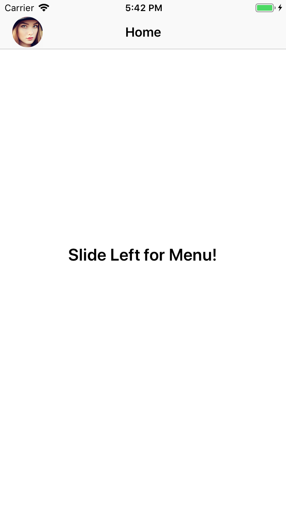
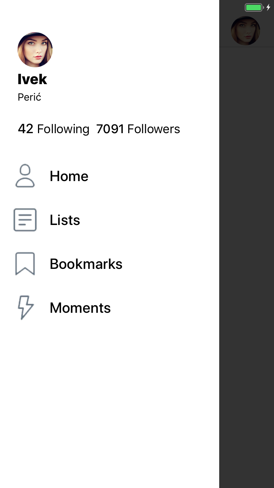
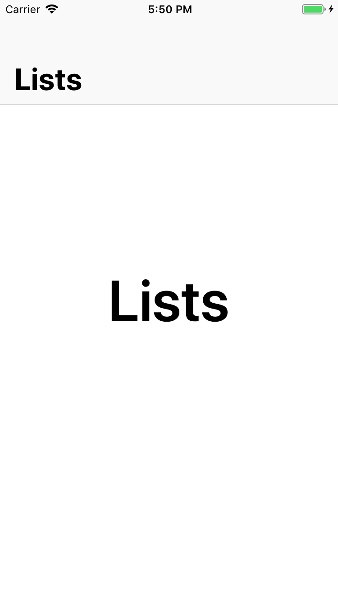
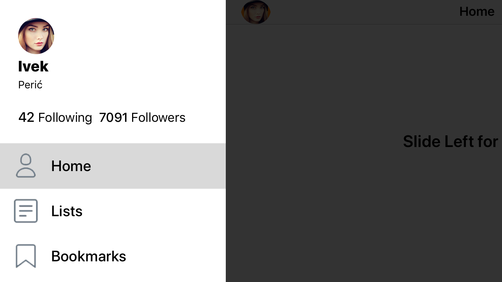
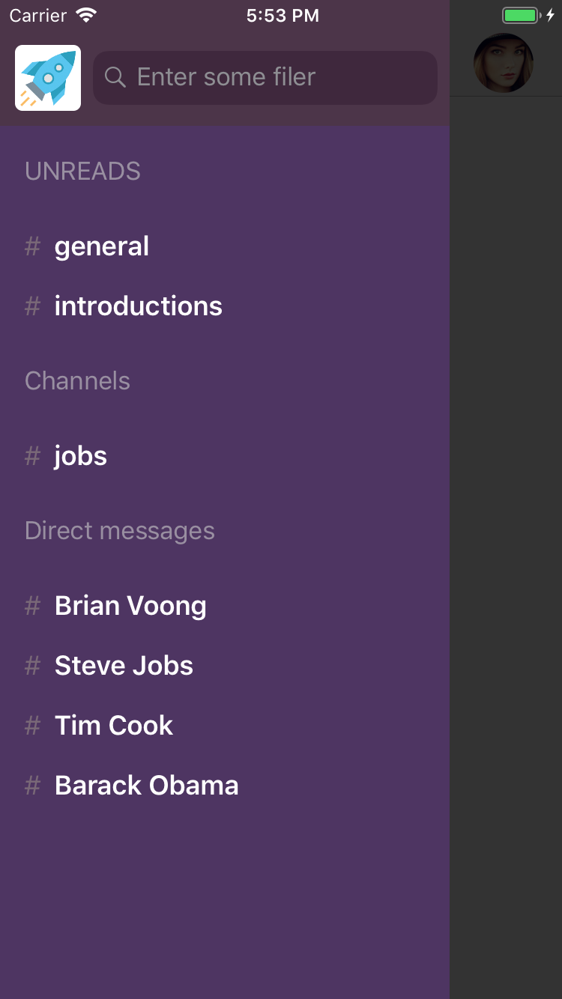
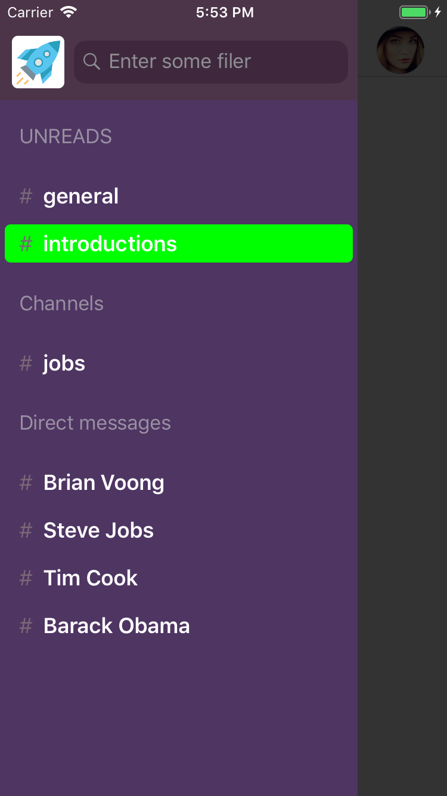
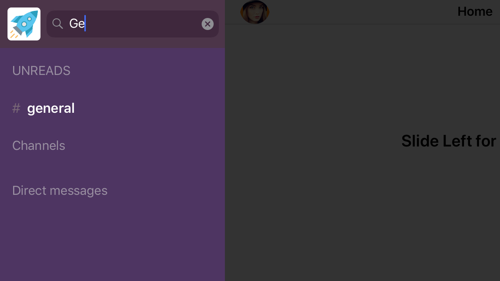

# SlideOutMenu

Basic slide in menu with supporting AutoLayout (Portrait/landscape, iPhone/iPad). 

# Workflow
Basically, the user needs to slide left to see the menu and slide right to close it or even tap on the grayed left side to close the menu. There is another opening of the menu and it is while tapping on the home left navigation bar icon. While selecting various items on the menu, the home gets updated.

         

# Main Features:
- Programmatically UI (no Stoaryboards)
- Easily customizable width of Menu
- Sliding gestures and callbacks for showing Menu
- Update Home by picking specific item in Menu
- Search Menu filter
- Custom colors when picking different cells on Menu

